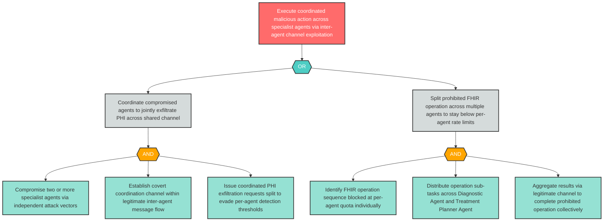

# Attack Tree: AGP-01 — Multi-Agent Coordination Enabling Coordinated Malicious Action

**Component**: Inter-Agent Communication Channel | **Risk Level**: Critical | **Finding**: AGP-01

Multi-agent coordination over the Inter-Agent Communication Channel creates potential for coordinated malicious action across specialist agents, where compromised agents can jointly execute operations that individually fall below per-agent detection thresholds.

