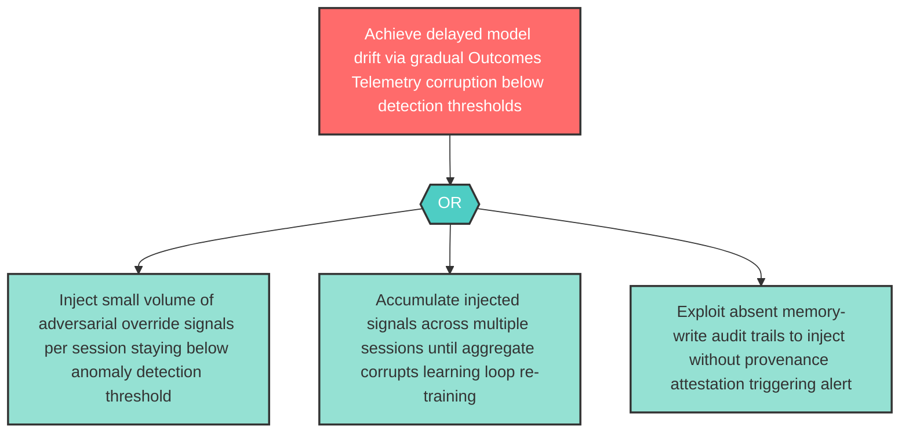

# Attack Tree: AGP-02 — Outcomes Telemetry Persistent-State Temporal Attack

**Component**: Outcomes Telemetry and Physician Override Audit Store | **Risk Level**: High | **Finding**: AGP-02

The architecture's persistent-state learning loop enables temporal attacks via gradual corruption — an adversary can inject adversarial signals below detection thresholds over time, with effects surfacing only during model re-training cycles.

