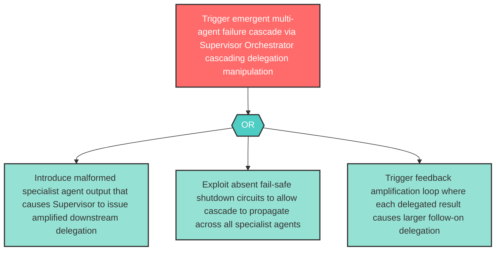

# Attack Tree: AGP-03 — Supervisor Orchestrator Multi-Agent Cascading Delegation Emergent Behavior

**Component**: Supervisor Orchestrator | **Risk Level**: High | **Finding**: AGP-03

Multi-agent cascading delegation from the Supervisor Orchestrator exhibits potential for emergent behavior — cascading failures, feedback amplification, or collective optimization that bypasses per-agent safety evaluation.

