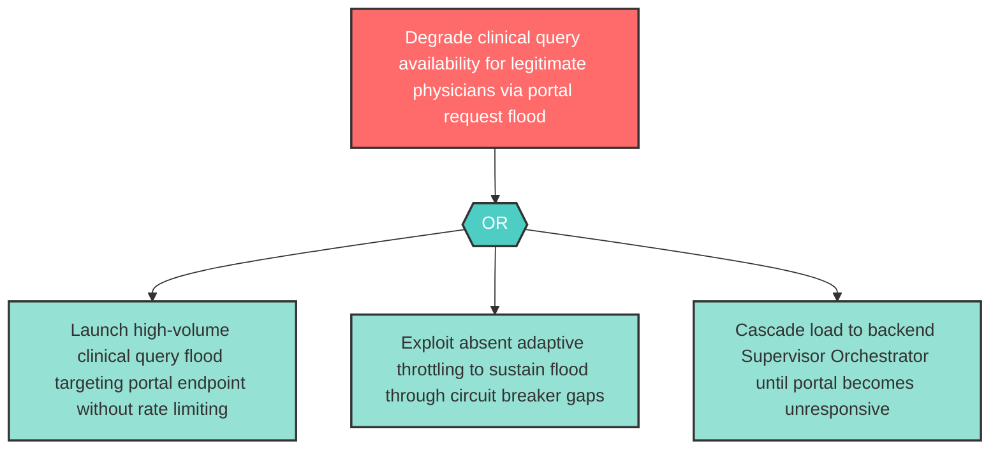

# Attack Tree: D-1 — Physician Clinical Portal Clinical Query Flood

**Component**: Physician Clinical Portal | **Risk Level**: High | **Finding**: D-1

An attacker floods the Physician Clinical Portal with clinical query requests, degrading availability for legitimate physicians during critical clinical decision periods.

