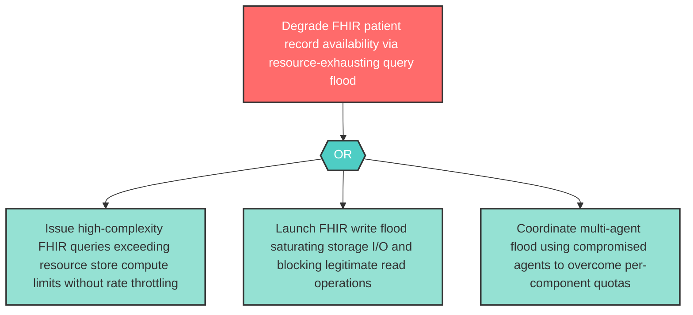

# Attack Tree: D-10 — FHIR Resource Store Query Flood

**Component**: FHIR Resource Store | **Risk Level**: High | **Finding**: D-10

An attacker executes resource-exhausting FHIR queries or write floods against the FHIR Resource Store, degrading availability for all components dependent on patient record retrieval.

