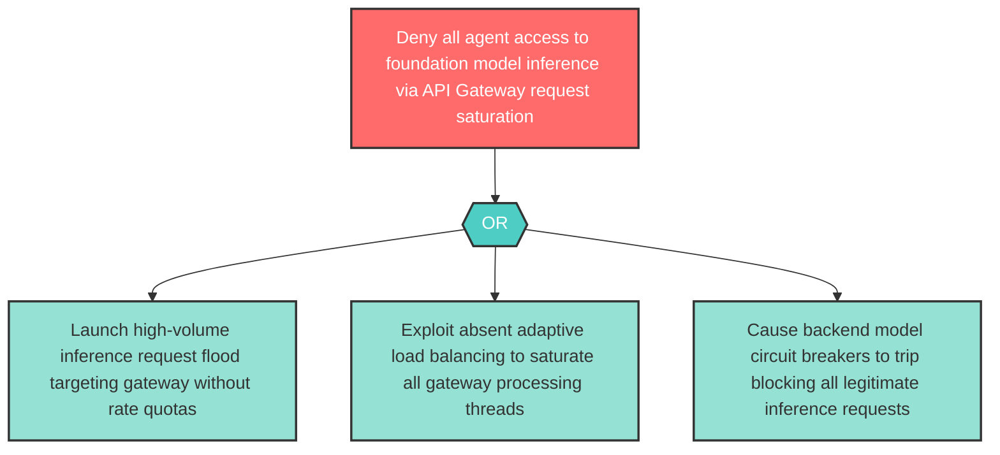

# Attack Tree: D-13 — Model Inference API Gateway Request Flood

**Component**: Model Inference API Gateway | **Risk Level**: High | **Finding**: D-13

An attacker saturates the Model Inference API Gateway through request floods, denying inference access to all agents dependent on foundation model capabilities.

