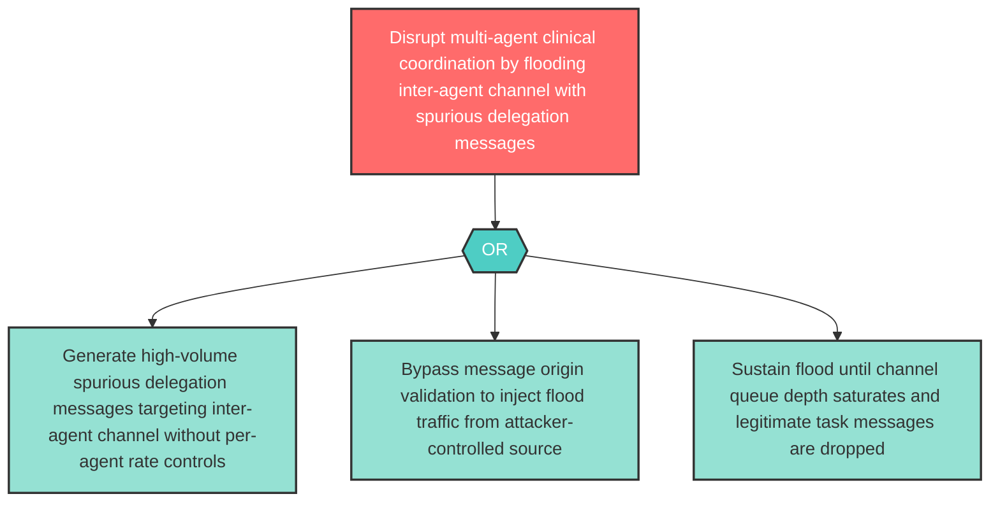

# Attack Tree: D-3 — Inter-Agent Channel Delegation Message Flood

**Component**: Inter-Agent Communication Channel | **Risk Level**: High | **Finding**: D-3

An attacker floods the Inter-Agent Communication Channel with spurious delegation messages, starving legitimate specialist agent task processing and disrupting multi-agent coordination.

