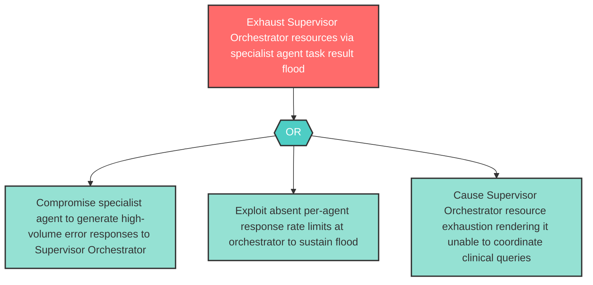

# Attack Tree: D-4 — Supervisor Orchestrator Resource Exhaustion via Task Result Flood

**Component**: Supervisor Orchestrator | **Risk Level**: High | **Finding**: D-4

An attacker who compromises one specialist agent floods the Supervisor Orchestrator with high-volume task results or error responses, causing resource exhaustion that renders the orchestrator unable to coordinate legitimate clinical queries.

