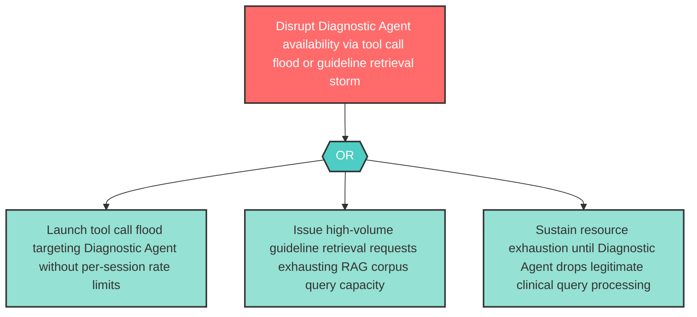

# Attack Tree: D-5 — Diagnostic Agent Resource Exhaustion via Tool Call Flood

**Component**: Diagnostic Agent | **Risk Level**: High | **Finding**: D-5

An attacker targets the Diagnostic Agent with resource-exhausting tool call floods or retrieval storms against the Clinical Guideline RAG Corpus, disrupting diagnostic capabilities for legitimate clinical queries.

