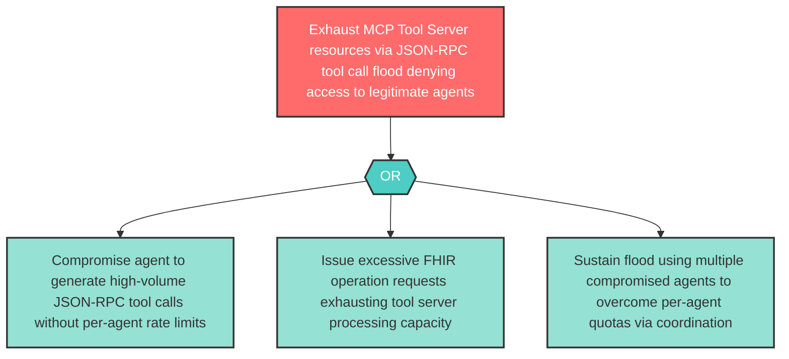

# Attack Tree: D-7 — Clinical MCP Tool Server JSON-RPC Flood

**Component**: Clinical MCP Tool Server | **Risk Level**: High | **Finding**: D-7

An attacker who compromises an agent floods the Clinical MCP Tool Server with excessive JSON-RPC tool calls or FHIR operations, exhausting server resources and denying tool access to legitimate agents.

