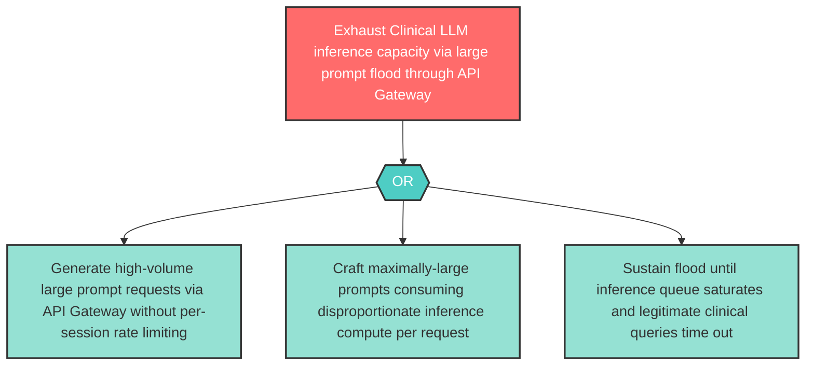

# Attack Tree: D-8 — Clinical LLM Inference Capacity Exhaustion

**Component**: Clinical LLM | **Risk Level**: High | **Finding**: D-8

An attacker exhausts Clinical LLM inference capacity through large prompt floods via the API Gateway, preventing legitimate clinical reasoning requests from being served.

