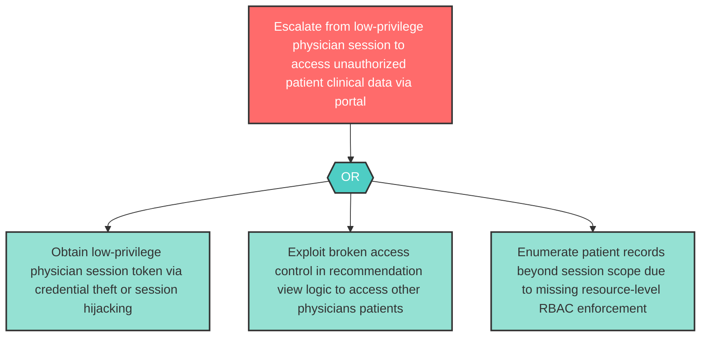

# Attack Tree: E-1 — Physician Clinical Portal Privilege Escalation

**Component**: Physician Clinical Portal | **Risk Level**: High | **Finding**: E-1

An attacker who gains access to a low-privilege physician session escalates to access clinical data belonging to other physicians or patients by exploiting broken access controls in the portal's recommendation view logic.

