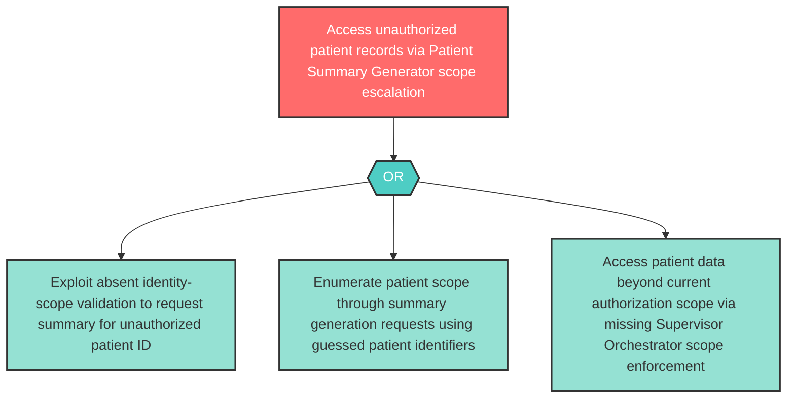

# Attack Tree: E-2 — Patient Summary Generator Unauthorized Patient Access

**Component**: Patient Summary Generator | **Risk Level**: High | **Finding**: E-2

An attacker exploits the Patient Summary Generator to request summaries for patients other than the authorized recipient, escalating access to unauthorized patient records.

