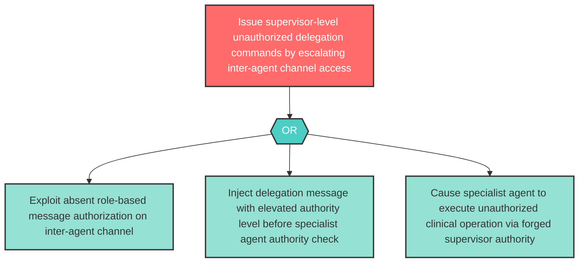

# Attack Tree: E-3 — Inter-Agent Channel Privilege Escalation to Supervisor Authority

**Component**: Inter-Agent Communication Channel | **Risk Level**: High | **Finding**: E-3

An attacker who compromises the Inter-Agent Communication Channel escalates channel access to issue supervisor-level delegation commands to specialist agents, bypassing the Supervisor Orchestrator's authority.

