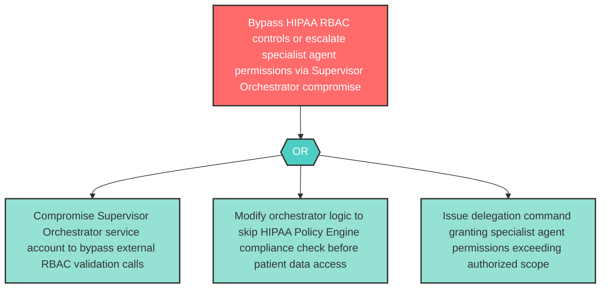

# Attack Tree: E-4 — Supervisor Orchestrator RBAC Bypass and Permission Escalation

**Component**: Supervisor Orchestrator | **Risk Level**: High | **Finding**: E-4

A compromised Supervisor Orchestrator escalates its own privilege to bypass RBAC checks enforced by the HIPAA Policy Engine, or grants escalated permissions to specialist agents beyond their authorized scope.

