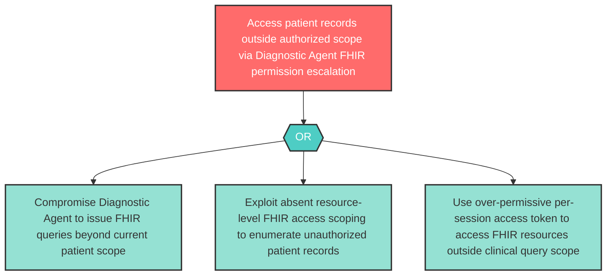

# Attack Tree: E-5 — Diagnostic Agent FHIR Access Scope Escalation

**Component**: Diagnostic Agent | **Risk Level**: High | **Finding**: E-5

A compromised Diagnostic Agent escalates beyond its authorized scope by issuing FHIR operations exceeding its data access permissions via the Clinical MCP Tool Server, accessing patient records outside the current clinical query.

