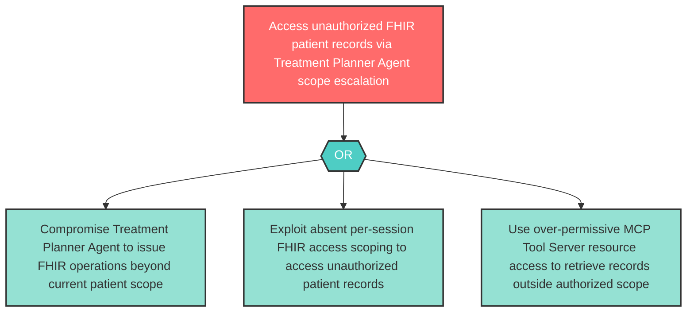

# Attack Tree: E-6 — Treatment Planner Agent FHIR Access Escalation

**Component**: Treatment Planner Agent | **Risk Level**: High | **Finding**: E-6

A compromised Treatment Planner Agent escalates its access to FHIR resources beyond the current patient's authorized scope through the Clinical MCP Tool Server.

