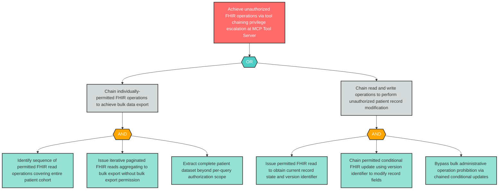

# Attack Tree: E-7 — MCP Tool Server FHIR Privilege Escalation via Tool Chaining

**Component**: Clinical MCP Tool Server | **Risk Level**: Critical | **Finding**: E-7

A compromised agent exploits the Clinical MCP Tool Server to escalate FHIR access beyond the calling agent's authorized scope via tool chaining — executing sequences of individually-permitted operations that collectively achieve unauthorized outcomes.

