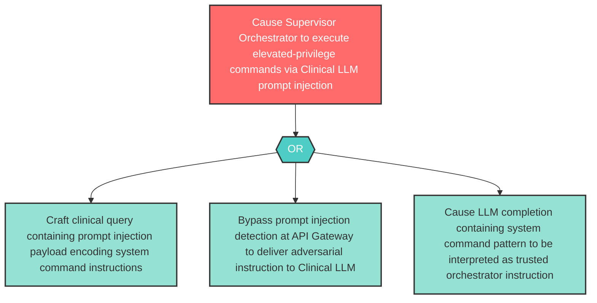

# Attack Tree: E-8 — Clinical LLM Prompt Injection Privilege Escalation

**Component**: Clinical LLM | **Risk Level**: High | **Finding**: E-8

An attacker exploits prompt injection in the Clinical LLM to gain elevated reasoning authority, causing the model to output instructions that the Supervisor Orchestrator interprets as authorized system commands with elevated privilege.

