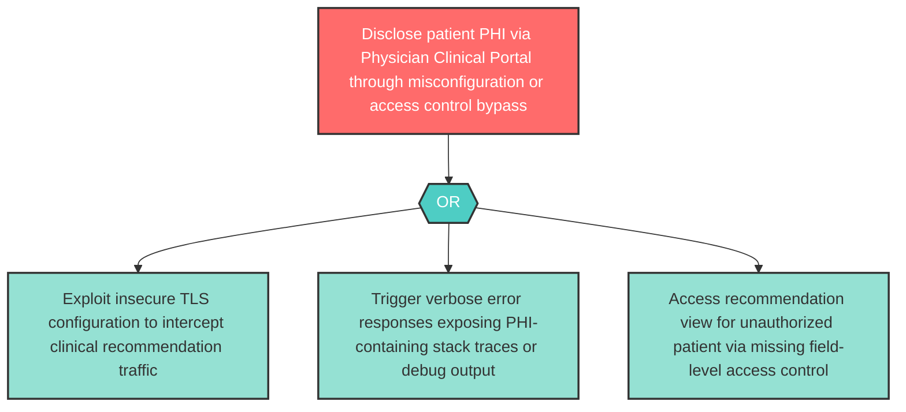

# Attack Tree: I-1 — Physician Clinical Portal PHI Disclosure

**Component**: Physician Clinical Portal | **Risk Level**: High | **Finding**: I-1

Sensitive clinical recommendation data including patient PHI may be disclosed through the Physician Clinical Portal via insecure HTTPS configuration, excessive error messages, or missing access controls on recommendation views.

