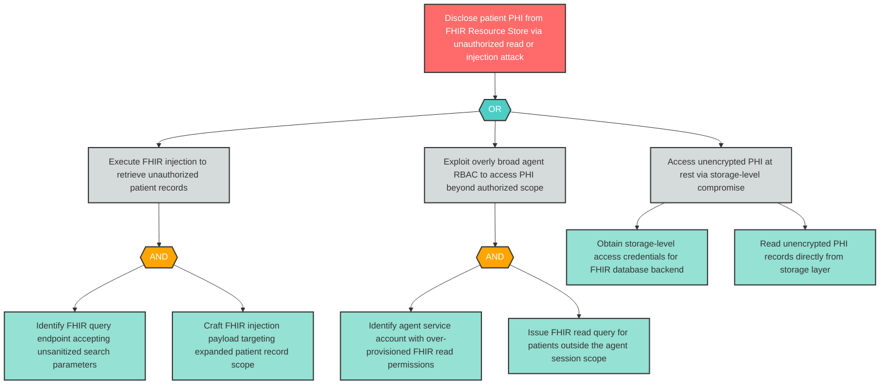

# Attack Tree: I-10 — FHIR Resource Store PHI Unauthorized Disclosure

**Component**: FHIR Resource Store | **Risk Level**: Critical | **Finding**: I-10

Patient PHI stored in the FHIR Resource Store may be disclosed through unauthorized read operations by agents with overly broad access, FHIR injection attacks, or missing PHI encryption at rest.

