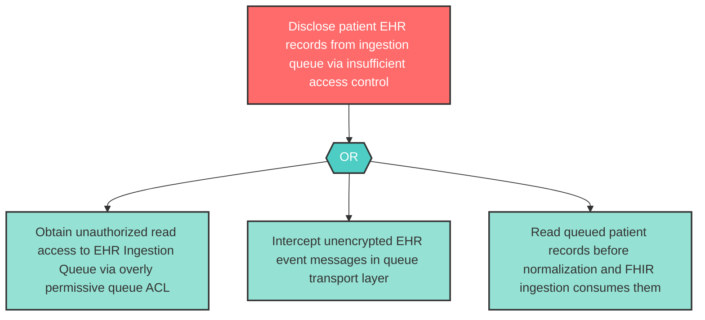

# Attack Tree: I-14 — EHR Ingestion Queue Patient Record Disclosure

**Component**: EHR Ingestion Queue | **Risk Level**: High | **Finding**: I-14

Patient EHR update events in the ingestion queue may be disclosed through insufficient queue access controls, allowing unauthorized parties to read enqueued patient records.

