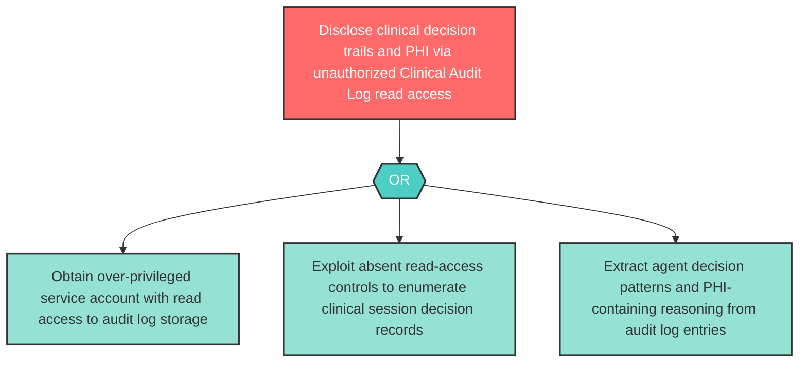

# Attack Tree: I-15 — Clinical Audit Log Unauthorized Read Access

**Component**: Clinical Audit Log | **Risk Level**: High | **Finding**: I-15

The Clinical Audit Log accumulates highly sensitive clinical decision trails. Unauthorized read access could disclose PHI, clinical reasoning, and agent decision patterns to adversaries.

