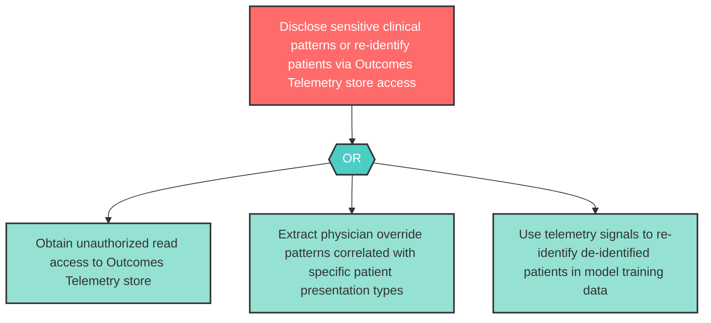

# Attack Tree: I-16 — Outcomes Telemetry Store Clinical Pattern Disclosure

**Component**: Outcomes Telemetry and Physician Override Audit Store | **Risk Level**: High | **Finding**: I-16

Physician override telemetry may contain implicit patient data. Unauthorized access to the Outcomes Telemetry store could disclose sensitive clinical patterns or enable re-identification of de-identified training data.

