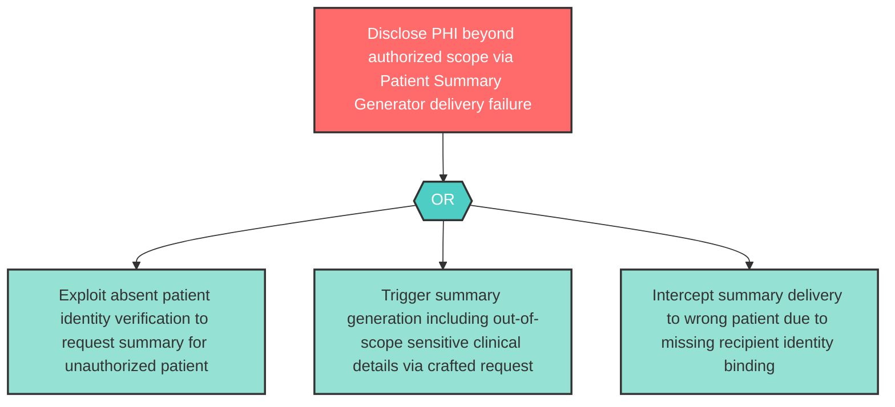

# Attack Tree: I-2 — Patient Summary Unauthorized PHI Disclosure

**Component**: Patient Summary Generator | **Risk Level**: High | **Finding**: I-2

Patient-facing summaries may inadvertently include sensitive clinical details beyond the authorized disclosure scope, or may be delivered to wrong patients due to missing identity validation.

