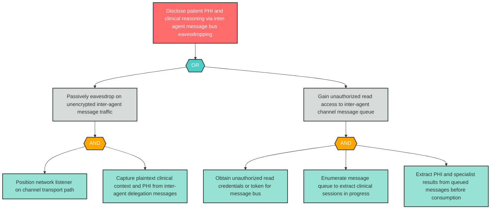

# Attack Tree: I-3 — Inter-Agent Channel PHI Disclosure

**Component**: Inter-Agent Communication Channel | **Risk Level**: Critical | **Finding**: I-3

Sensitive clinical context including patient PHI and clinical reasoning may be disclosed through the inter-agent message bus if messages are transmitted without encryption or if channel access is insufficiently restricted.

