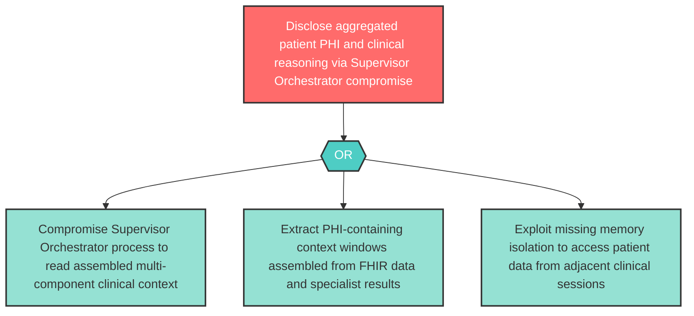

# Attack Tree: I-4 — Supervisor Orchestrator Aggregated Clinical Context Exposure

**Component**: Supervisor Orchestrator | **Risk Level**: High | **Finding**: I-4

A compromise of the Supervisor Orchestrator may expose aggregated sensitive patient data from FHIR, specialist results, and model outputs — more sensitive than any individual component's data.

