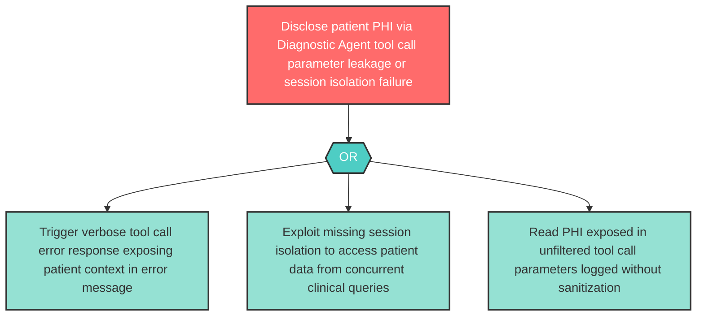

# Attack Tree: I-5 — Diagnostic Agent Patient Context Disclosure

**Component**: Diagnostic Agent | **Risk Level**: High | **Finding**: I-5

The Diagnostic Agent may expose sensitive patient context retrieved from Clinical Guideline RAG Corpus and risk stratification results through tool call parameters, error responses, or insufficient isolation between patient sessions.

