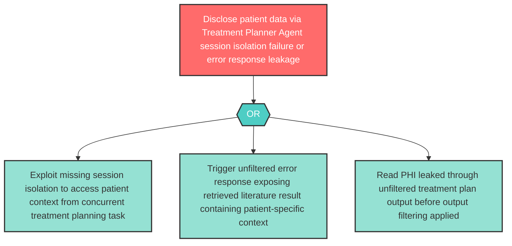

# Attack Tree: I-6 — Treatment Planner Agent Patient Data Disclosure

**Component**: Treatment Planner Agent | **Risk Level**: High | **Finding**: I-6

The Treatment Planner Agent may disclose sensitive patient data retrieved from the Medical Literature Vector Index through insufficient session isolation or unfiltered error responses.

