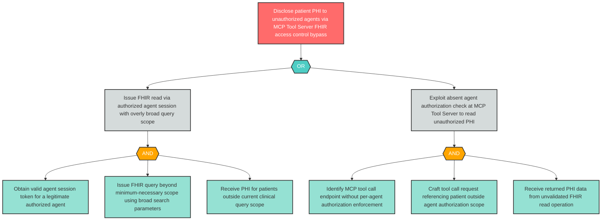

# Attack Tree: I-7 — MCP Tool Server PHI Disclosure to Unauthorized Agents

**Component**: Clinical MCP Tool Server | **Risk Level**: Critical | **Finding**: I-7

The Clinical MCP Tool Server may expose PHI from FHIR read operations to unauthorized agents through insufficient access controls on tool results or overly broad FHIR queries.

