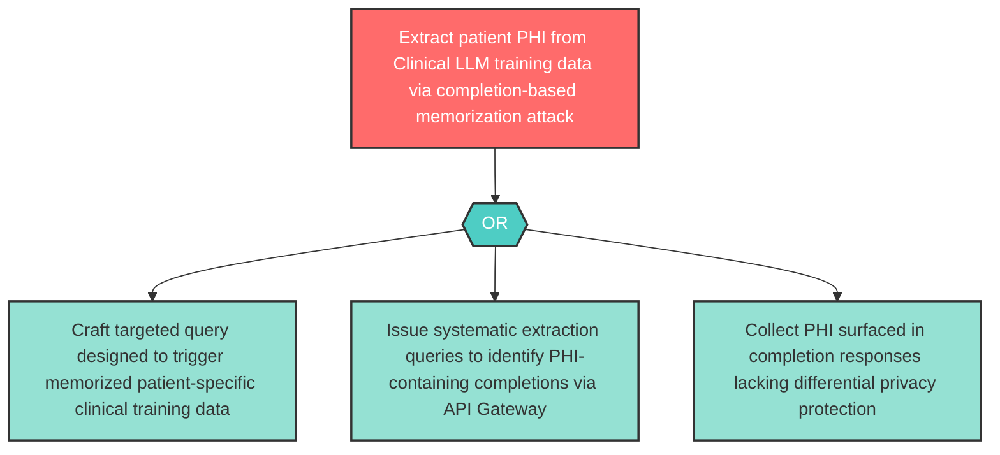

# Attack Tree: I-8 — Clinical LLM Training Data PHI Memorization

**Component**: Clinical LLM | **Risk Level**: High | **Finding**: I-8

The Clinical LLM may memorize and surface sensitive training data including patient records in its completions, disclosing PHI to agents that did not have authorization to access it.

