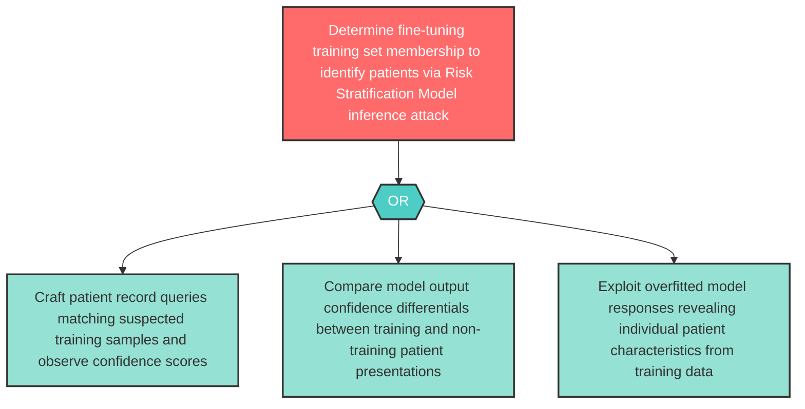

# Attack Tree: I-9 — Risk Stratification Model Membership Inference Attack

**Component**: Risk Stratification Model | **Risk Level**: High | **Finding**: I-9

The Risk Stratification Model may leak patient cohort data from its fine-tuning training set through membership inference attacks or overfitted responses revealing individual patient characteristics.

