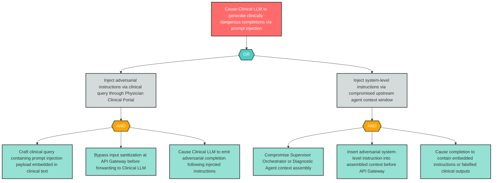

# Attack Tree: LLM-1 — Clinical LLM Prompt Injection via API Gateway

**Component**: Clinical LLM | **Risk Level**: Critical | **Finding**: LLM-1

An attacker injects adversarial prompts into the clinical context window passed to the Clinical LLM via the API Gateway, causing the model to generate harmful, false, or clinically dangerous completions incorporated into clinical recommendations.

