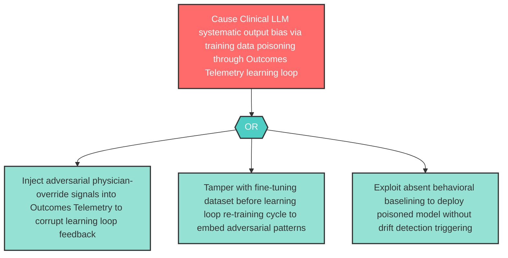

# Attack Tree: LLM-2 — Clinical LLM Training Data Poisoning via Learning Loop

**Component**: Clinical LLM | **Risk Level**: High | **Finding**: LLM-2

An adversary poisons the training data or fine-tuning feedback incorporated into the Clinical LLM via the Outcomes Telemetry learning loop, causing the model to produce systematically biased or manipulated clinical completions after re-training.

