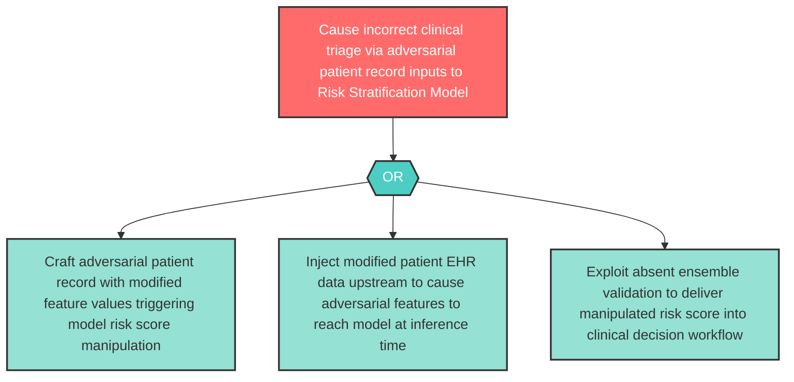

# Attack Tree: LLM-4 — Risk Stratification Model Adversarial Input Manipulation

**Component**: Risk Stratification Model | **Risk Level**: High | **Finding**: LLM-4

An attacker crafts adversarial patient record inputs passed to the Risk Stratification Model to generate manipulated risk scores, causing incorrect clinical triage and resource allocation decisions.

