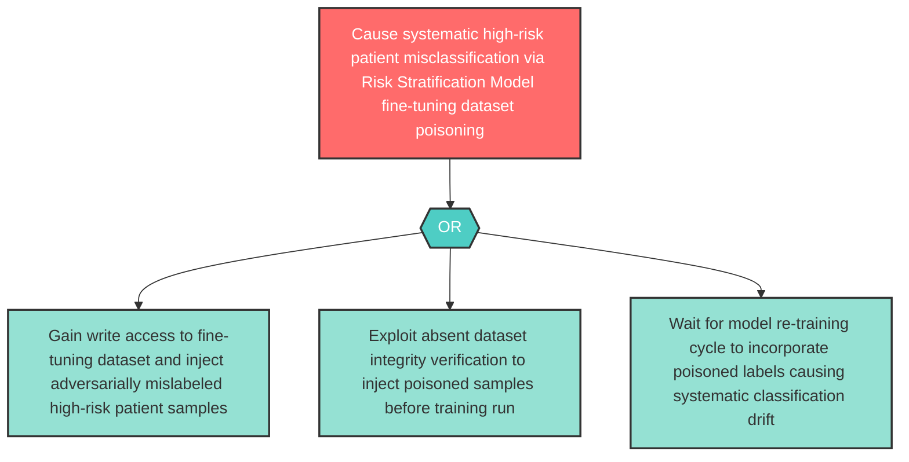

# Attack Tree: LLM-5 — Risk Stratification Model Fine-Tuning Dataset Poisoning

**Component**: Risk Stratification Model | **Risk Level**: High | **Finding**: LLM-5

An adversary poisons the supervised fine-tuning dataset used to train the Risk Stratification Model, embedding adversarial patterns that cause the model to systematically misclassify high-risk patients as low-risk after re-training.

