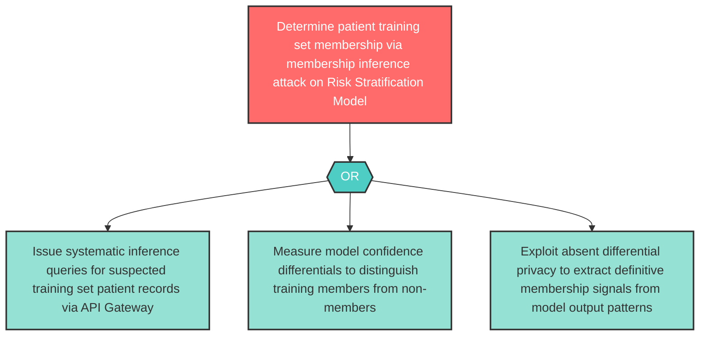

# Attack Tree: LLM-6 — Risk Stratification Model Membership Inference Privacy Attack

**Component**: Risk Stratification Model | **Risk Level**: High | **Finding**: LLM-6

An adversary conducts membership inference attacks against the Risk Stratification Model to determine which patients were included in the fine-tuning dataset, violating patient privacy even without direct data access.

