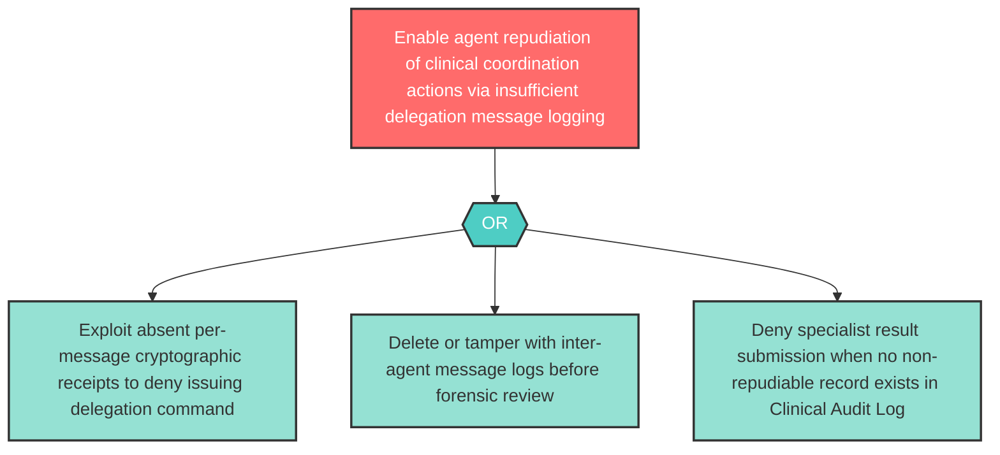

# Attack Tree: R-5 — Inter-Agent Channel Repudiation of Delegation Messages

**Component**: Inter-Agent Communication Channel | **Risk Level**: High | **Finding**: R-5

The Inter-Agent Communication Channel may fail to provide non-repudiable records of all delegation messages and specialist results, allowing agents to deny actions taken during the coordination flow.

