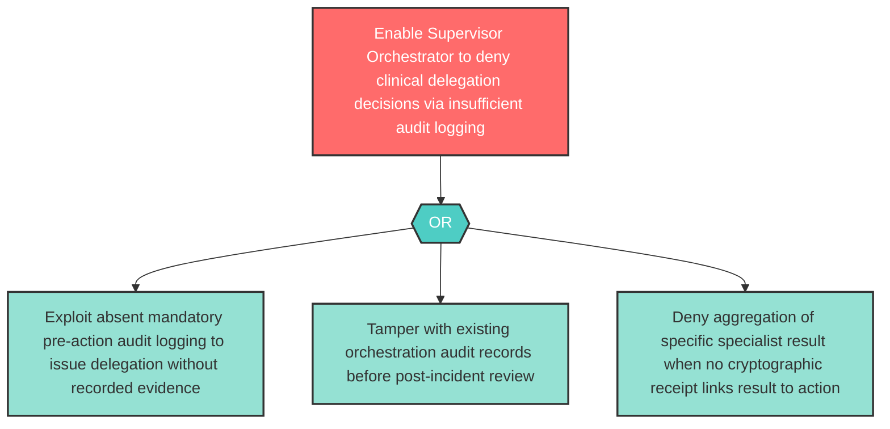

# Attack Tree: R-6 — Supervisor Orchestrator Delegation Record Repudiation

**Component**: Supervisor Orchestrator | **Risk Level**: High | **Finding**: R-6

The Supervisor Orchestrator may fail to maintain non-repudiable records of which delegation commands it issued and which specialist results it aggregated, making agent accountability impossible.

