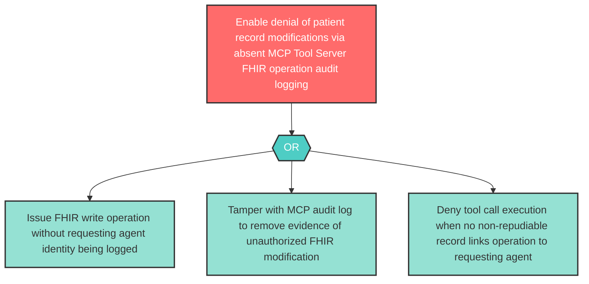

# Attack Tree: R-9 — MCP Tool Server FHIR Operation Repudiation

**Component**: Clinical MCP Tool Server | **Risk Level**: High | **Finding**: R-9

The Clinical MCP Tool Server may fail to maintain non-repudiable records of which FHIR operations were executed in response to agent tool calls, making it impossible to trace patient record modifications to their source.

