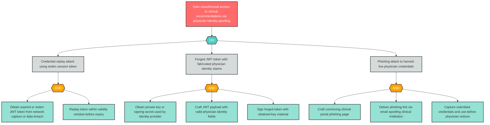

# Attack Tree: S-1 — Physician Identity Spoofing

**Component**: Physician | **Risk Level**: Critical | **Finding**: S-1

An attacker replays or forges physician credentials to gain unauthorized access to clinical recommendations and patient data.

