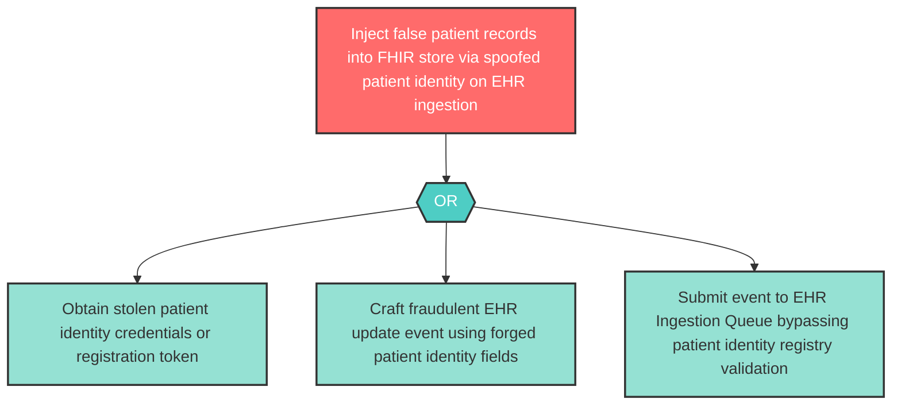

# Attack Tree: S-2 — Patient Identity Spoofing for EHR Injection

**Component**: Patient | **Risk Level**: High | **Finding**: S-2

An attacker submits fraudulent EHR update events by spoofing a patient identity, injecting false patient records into the ingestion pipeline.

