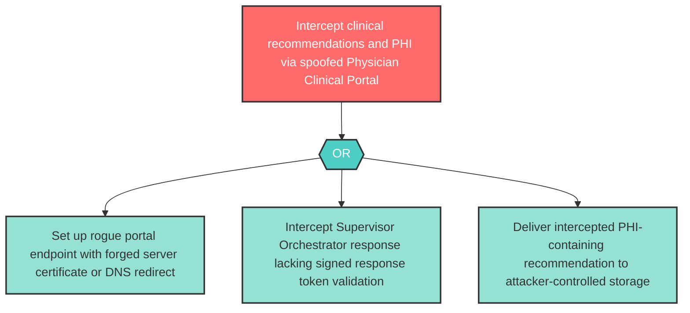

# Attack Tree: S-3 — Physician Clinical Portal Spoofing

**Component**: Physician Clinical Portal | **Risk Level**: High | **Finding**: S-3

An attacker spoofs the Physician Clinical Portal to intercept clinical recommendation responses from the Supervisor Orchestrator, receiving sensitive patient data intended for legitimate physicians.

