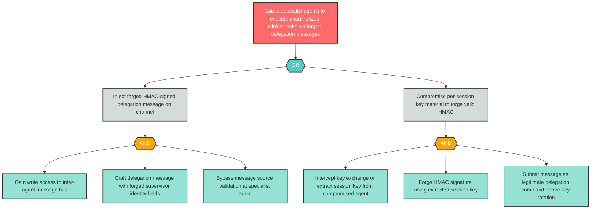

# Attack Tree: S-5 — Inter-Agent Channel Supervisor Delegation Spoofing

**Component**: Inter-Agent Communication Channel | **Risk Level**: Critical | **Finding**: S-5

An attacker who gains access to the inter-agent message bus spoofs supervisor delegation messages, causing specialist agents to execute forged orchestration commands.

