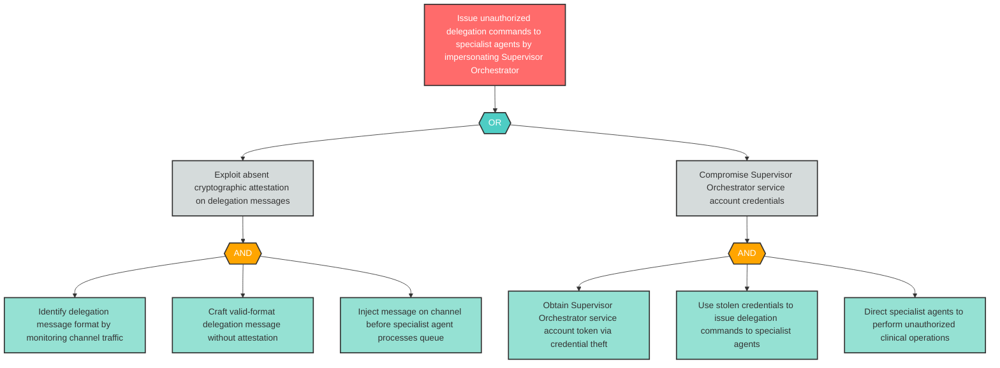

# Attack Tree: S-6 — Supervisor Orchestrator Identity Impersonation

**Component**: Supervisor Orchestrator | **Risk Level**: Critical | **Finding**: S-6

An attacker impersonates the Supervisor Orchestrator to issue unauthorized delegation commands to specialist agents, bypassing orchestration controls.

