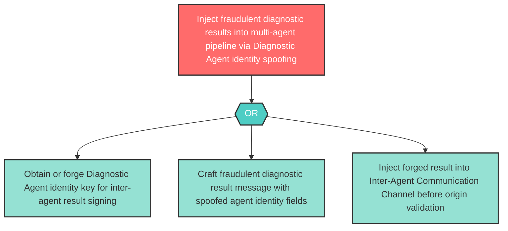

# Attack Tree: S-7 — Diagnostic Agent Identity Spoofing

**Component**: Diagnostic Agent | **Risk Level**: High | **Finding**: S-7

An attacker spoofs the Diagnostic Agent's identity to inject fraudulent diagnostic results into the Inter-Agent Communication Channel, polluting the treatment planning process.

