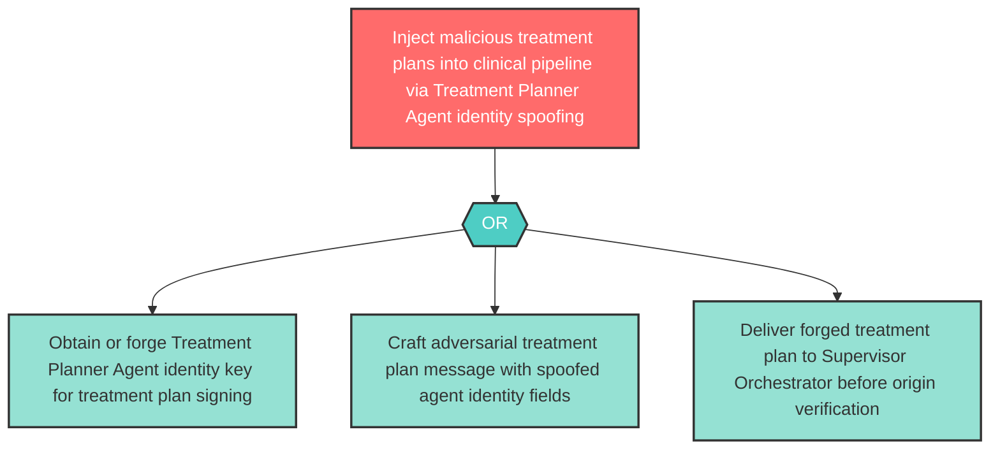

# Attack Tree: S-8 — Treatment Planner Agent Identity Spoofing

**Component**: Treatment Planner Agent | **Risk Level**: High | **Finding**: S-8

An attacker spoofs Treatment Planner Agent responses to inject malicious treatment plans into the inter-agent coordination flow.

