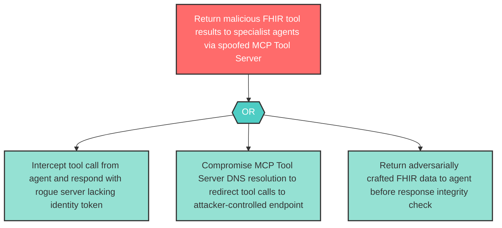

# Attack Tree: S-9 — Clinical MCP Tool Server Spoofing

**Component**: Clinical MCP Tool Server | **Risk Level**: High | **Finding**: S-9

An attacker spoofs the Clinical MCP Tool Server to return malicious tool results to Diagnostic Agent or Treatment Planner Agent, corrupting clinical decision inputs.

