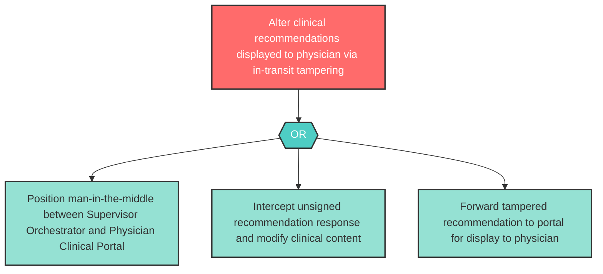

# Attack Tree: T-1 — Clinical Recommendation Response Tampering in Transit

**Component**: Physician Clinical Portal | **Risk Level**: High | **Finding**: T-1

An attacker tampers with clinical recommendation responses in transit between Supervisor Orchestrator and the Physician Clinical Portal, altering displayed recommendations without physician awareness.

