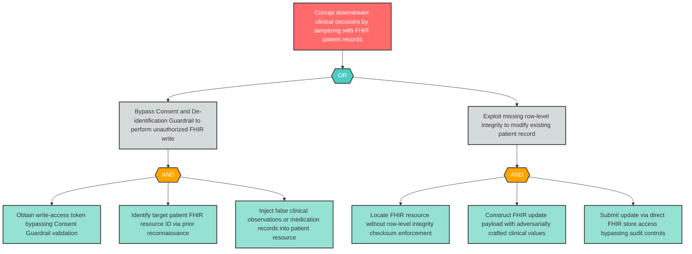

# Attack Tree: T-10 — FHIR Resource Store Patient Record Tampering

**Component**: FHIR Resource Store | **Risk Level**: Critical | **Finding**: T-10

An attacker with access to the FHIR Resource Store tampers with patient records, injecting false clinical data that corrupts all downstream clinical decision processes.

